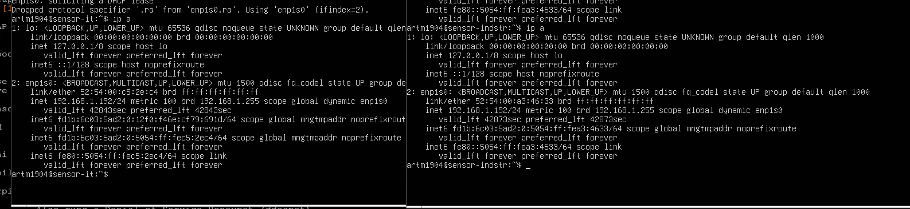

#  Проблема: Судя по выводу ip a, физический интерфейс enp3s0f4u1 всё еще работает как обычная сетевая карта (на нем висит например IP 192.168.1.182), а мост br0 находится в состоянии DOWN (NO-CARRIER), потому что физическая карта не переключилась "внутрь" него.


Это происходит потому, что старое подключение (NetworkManager обычно называет его "Wired connection 1" или "Проводное соединение 1") имеет более высокий приоритет и сейчас активно. Оно "держит" карту и не дает ей стать частью моста.

Вам нужно отключить старое соединение и включить мост.

```
[artm1904@archlinux ~] nmcliconaddtypebridgeifnamebr0con−namebr0Error:Failedtoadd′br0′connection:Insufficientprivileges[artm1904@archlinux ] nmcliconaddtypebridgeifnamebr0con−namebr0Error:Failedtoadd′br0′connection:Insufficientprivileges[artm1904@archlinux ] sudo nmcli con add type bridge ifname br0 con-name br0
[sudo] password for artm1904:
Connection 'br0' (16685e1e-a0da-492a-90fb-ab84a7c56b1e) successfully added.
[artm1904@archlinux ~] sudonmcliconmodifybr0bridge.stpno
[artm1904@archlinux ] sudonmcliconmodifybr0bridge.stpno
[artm1904@archlinux ]   ip link
1: lo: <LOOPBACK,UP,LOWER_UP> mtu 65536 qdisc noqueue state UNKNOWN mode DEFAULT group default qlen 1000
link/loopback 00:00:00:00:00:00 brd 00:00:00:00:00:00
2: wlan0: <NO-CARRIER,BROADCAST,MULTICAST,UP> mtu 1500 qdisc noqueue state DOWN mode DORMANT group default qlen 1000
link/ether 2a:63:3c:68:7c:bc brd ff:ff:ff:ff:ff:ff permaddr 8c:c8:4b:06:22:69
3: enp3s0f4u1: <BROADCAST,MULTICAST,UP,LOWER_UP> mtu 1500 qdisc fq_codel state UP mode DEFAULT group default qlen 1000
link/ether 00:e0:4c:68:00:e0 brd ff:ff:ff:ff:ff:ff
altname enx00e04c6800e0
4: br0: <NO-CARRIER,BROADCAST,MULTICAST,UP> mtu 1500 qdisc noqueue state DOWN mode DEFAULT group default qlen 1000
link/ether 26:6b:80:4f:e2:3b brd ff:ff:ff:ff:ff:ff
< slave-type bridge con-name bridge-slave ifname enp3s0f4u1 master br0
Connection 'bridge-slave' (34cdae8a-0482-4d40-8c24-de77b6b34c37) successfully added.
[artm1904@archlinux ~]  ip a
1: lo: <LOOPBACK,UP,LOWER_UP> mtu 65536 qdisc noqueue state UNKNOWN group default qlen 1000
link/loopback 00:00:00:00:00:00 brd 00:00:00:00:00:00
inet 127.0.0.1/8 scope host lo
valid_lft forever preferred_lft forever
inet6 ::1/128 scope host noprefixroute
valid_lft forever preferred_lft forever
2: wlan0: <NO-CARRIER,BROADCAST,MULTICAST,UP> mtu 1500 qdisc noqueue state DOWN group default qlen 1000
link/ether 2a:63:3c:68:7c:bc brd ff:ff:ff:ff:ff:ff permaddr 8c:c8:4b:06:22:69
3: enp3s0f4u1: <BROADCAST,MULTICAST,UP,LOWER_UP> mtu 1500 qdisc fq_codel state UP group default qlen 1000
link/ether 00:e0:4c:68:00:e0 brd ff:ff:ff:ff:ff:ff
altname enx00e04c6800e0
inet 192.168.1.182/24 brd 192.168.1.255 scope global dynamic noprefixroute enp3s0f4u1
valid_lft 42676sec preferred_lft 42676sec
inet6 fd1b:6c03:5ad2::890/128 scope global dynamic noprefixroute
valid_lft 42675sec preferred_lft 42675sec
inet6 fd1b:6c03:5ad2:0:2758:c90d:abef:8d7e/64 scope global noprefixroute
valid_lft forever preferred_lft forever
inet6 fe80::c4c9:6d9c:ad46:9353/64 scope link noprefixroute
valid_lft forever preferred_lft forever
4: br0: <NO-CARRIER,BROADCAST,MULTICAST,UP> mtu 1500 qdisc noqueue state DOWN group default qlen 1000
link/ether 26:6b:80:4f:e2:3b brd ff:ff:ff:ff:ff:ff

```


Исправление

Внимание: Если вы подключены по SSH, выполнение следующей команды разорвет соединение. Вам нужно будет переподключиться через несколько секунд (IP адрес скорее всего останется тем же, но уже на интерфейсе br0). Если IP сменится (зависит от роутера), вам нужно будет посмотреть его в админке роутера.

Выполните команды по порядку:

1. Посмотрите список подключений, чтобы узнать точное имя старого профиля:
code Bash

nmcli con show

Скорее всего, вы увидите что-то вроде Wired connection 1 в колонке NAME напротив устройства enp3s0f4u1.

2. Отключите старое соединение и включите мост:
(Замените "Wired connection 1" на то имя, которое увидели в шаге 1. Кавычки обязательны, если есть пробелы).
code Bash

sudo nmcli con down "Wired connection 1" && sudo nmcli con up br0

Как проверить, что всё получилось

После выполнения команд выполните ip a еще раз. Правильная картина должна выглядеть так:

    Интерфейс enp3s0f4u1:

        Не должен иметь строки inet 192.168...

        Должен иметь строчку master br0.

    Интерфейс br0:

        Должен иметь статус UP (вместо NO-CARRIER).

        Должен получить IP-адрес (inet 192.168...).

Как только br0 получит IP-адрес, интернет на хосте заработает, и вы сможете использовать этот br0 в настройках виртуальных машин.


# После клонирования ВМ везде одинаковые IP 



Это классическая проблема при клонировании Linux-систем.

Причина:
Современные DHCP-клиенты в Linux (особенно на базе systemd/Debian, на котором основан T-Pot) при запросе IP-адреса отправляют не только MAC-адрес, но и DUID (DHCP Unique Identifier). Этот DUID генерируется на основе /etc/machine-id при первой установке.

Когда вы клонировали ВМ, вы скопировали и этот ID. Ваш роутер видит: "Ага, это тот же самый компьютер (тот же ID), просто с другой сетевой картой", и выдает ему тот же самый IP-адрес, который был выдан первой машине.

Решение:
Вам нужно сбросить machine-id на клонированной машине.

Выполните следующие команды в терминале второй (клонированной) виртуальной машины:

    Очистите текущий Machine ID:
    
```
    sudo truncate -s 0 /etc/machine-id
```

- (Не удаляйте файл полностью, просто сделайте его пустым, это безопаснее для systemd).

    Удалите привязку DBus (если есть):
    
```
    sudo rm /var/lib/dbus/machine-id
    sudo ln -s /etc/machine-id /var/lib/dbus/machine-id
```

    Сгенерируйте новый ID:
    
```
    sudo systemd-machine-id-setup
```

    Перезагрузите ВМ:
```
    sudo reboot
```

После перезагрузки система сгенерирует новый уникальный идентификатор для DHCP, и ваш роутер выдаст ей новый IP-адрес (например, 192.168.1.193), отличный от первой машины.