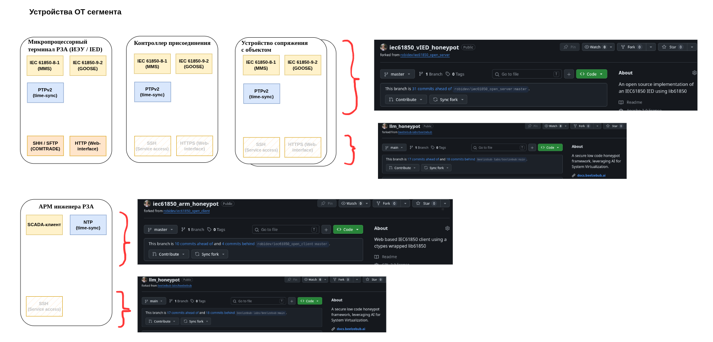
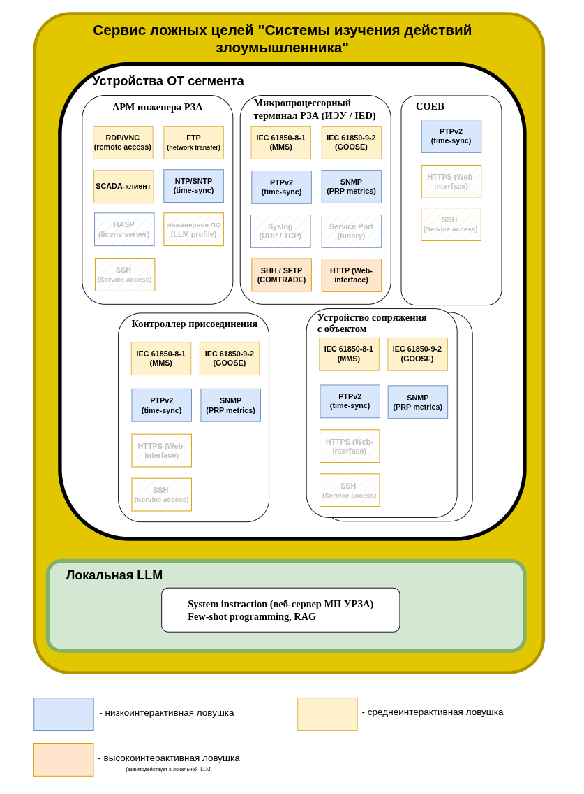
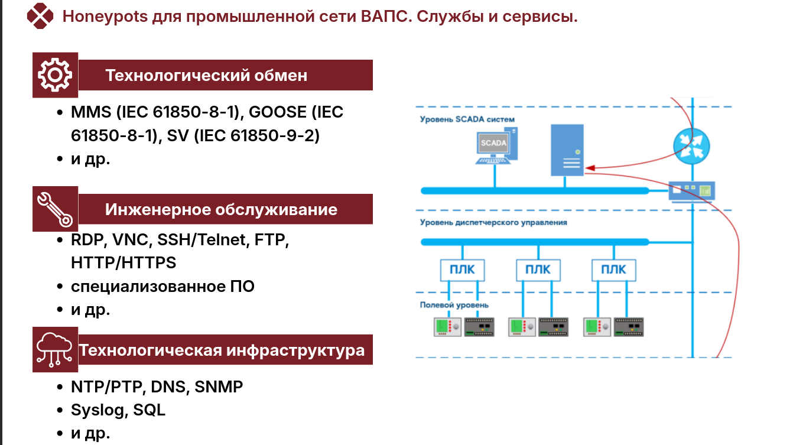
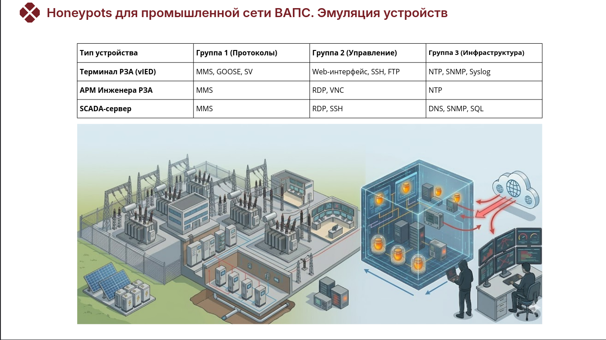
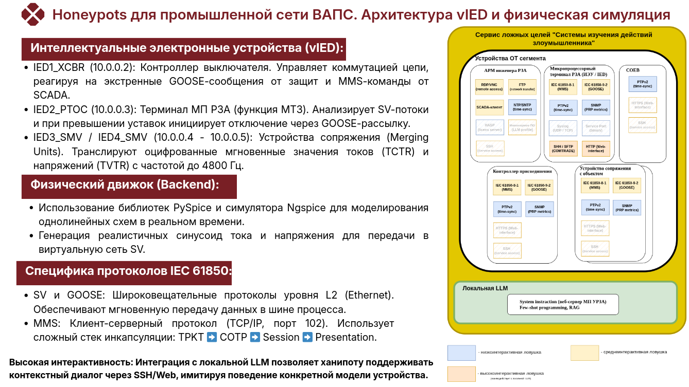
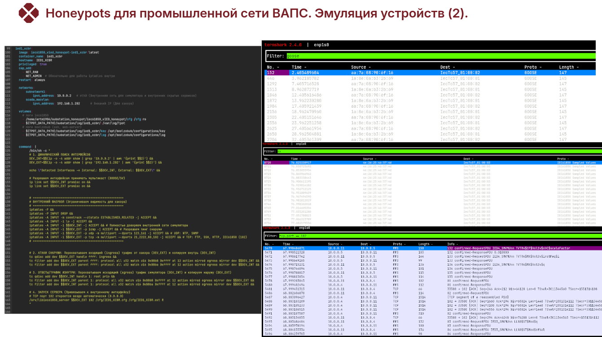

Тут краткое описание того что представляют собой ханипоты, почему они именно такие, с какими атаками могут бороться и так далее.

Что типо данный проект реализует такие-то функции и т.д., они работают вот так, настраиваются так, запускаются так (но это будет в других файлах), могут бороться с такими-то атаками.

Ловушки для технологической части, имитация работы ПС

Для даного сегмента сети требуется разработка высокоинтерактивных ханипотов для
SCADA-систем, АРМ и vIED на базе IEC 61850 и использовании LLM для эмуляции
SSH/Web, сетевых протоколов. Данный список сервисов должен быть дополнен
вспомогательной инфраструктурой.
Для ханипотов, имитирующих устройства ОТ (IED, ПЛК, АРМ), наиболее логичным будет
деление на следующие функциональные группы:
1. Группа технологического обмена (Data Plane)
Это «сердце» промышленного устройства. Сюда входят протоколы, по которым
передаются команды управления и телеметрия.
Сервисы: MMS (IEC 61850-8-1), GOOSE (хотя это L2, в ханипотах часто эмулируется
логика), так же могут быть и Modbus TCP, DNP3, Profinet, S7 Communication (но в рамках
данной работы рассматривался только 61850)
Цель: Имитация живого взаимодействия и обмена данными между полевым
оборудованием и SCADA.
2. Группа инженерного обслуживания (Control/Management Plane)
Сервисы, предназначенные для настройки оборудования инженерами или интегратора ми.
Сервисы: RDP (для АРМ РЗА), SSH/Telnet (для конфигурирования контроллеров или
коммутаторов), FTP/SFTP (передача файлов конфигурации и осциллограмм), HTTP/HTTPS
(веб-интерфейс настройки терминала).
Особенность: Здесь уместно использовать ваши наработки с LLM, чтобы имитировать
специфические консольные ответы вендорского оборудования.
3. Группа технологической инфраструктуры
Сервисы, обеспечивающие жизнеспособность самой сети и синхронизацию процессов.
Сервисы: NTP/PTP (критически важны для меток времени в РЗА), SNMP (мониторинг
состояния железа), DNS (если используется внутренняя адресация), Syslog.
Цель: Создание фона «здоровой» сети, в которой устройства общаются с серверами
мониторинга и времени

«Перейдем к детальному разбору нашего "цифрового двойника" подстанции. В
промышленном сегменте стенда мы реализовали цепочку из четырех ключевых устройств,
которые полностью воспроизводят логику работы реальной ячейки.
Сердцем измерительной части являются два устройства сопряжения — IED3 и IED4. Это
виртуальные Merging Units. Они подключены к нашему физическому движку, построенному
на базе PySpice и Ngspice. Несмотря на то, что PySpice давно не обновлялся, он остается
надежным интерфейсом для моделирования электротехнических цепей на Python. Мы
получаем "чистые" графики токов и напряжений, оцифровываем их и льем в сеть в виде
непрерывного потока Sampled Values (SV).
За логику защиты отвечает узел IED2_PTOC. Это программная реализация терминала
релейной защиты. Он "слушает" SV-трафик от измерителей и, если видит перегрузку,
мгновенно отправляет GOOSE-сообщение на отключение. Это сообщение ловит
IED1_XCBR — контроллер выключателя, который и совершает виртуальную коммутацию .
Важно отметить сетевую реализацию. Для максимальной достоверности мы разделили
трафик. Быстрые протоколы — SV и GOOSE — работают на уровне L2. А для управления и
мониторинга используется протокол MMS, работающий на 102-м порту.
Здесь мы воссоздали классическую "матрешку" протоколов, где MMS инкапсулируется в
уровни представления и сессии согласно стандартам OSI. Для хакера это выглядит как
абсолютно легитимный стек. Чтобы добавить еще один уровень сложности, мы внедрили в
каждый IED модуль высокоинтерактивного обмана на базе LLM. Это значит, что если
атакующий решит выйти за рамки протокола MMS и попытается зайти на устройство через
терминал, он встретит адаптивную нейросеть, которая поддержит легенду конкретного
производителя оборудования, значительно увеличивая время его пребывания в ловушке и
давая нам бесценные данные о его тактиках».

