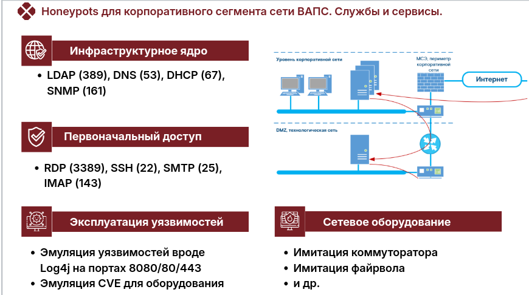
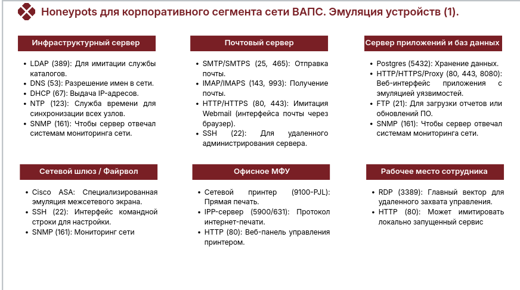
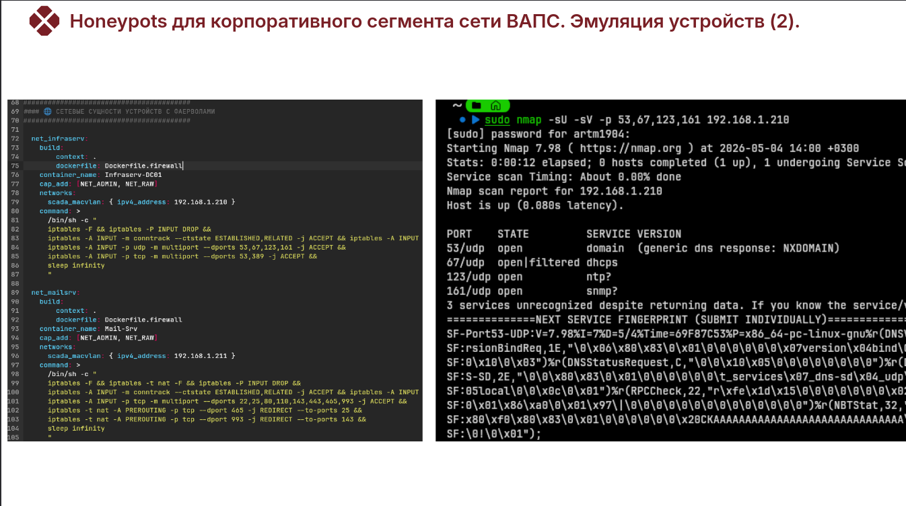

Дополнительной настройки не требуется. Использовался T-Pot с изначальной конфигурацией, где был изменен docker-compose.yml для добавления новых узлов из логики одно устойтсво - много сервисов и откртых портов.

Корпоративная сеть подстанции фактически является стандартной IT-средой, через
которую часто начинаются целевые атаки (APT). Задача ханипота здесь — выглядеть как
типичный офисный узел или сервер управления службой.
Этот набор сервисов для корпоративного сегмента высокоавтоматизированной подстанции
(ВАПС) выглядит крайне уместным и сбалансированным:
1) Инфраструктурное «ядро» (LDAP, DNS, DHCP, SNMP):
Это критически важные службы. Для злоумышленника, закрепившегося в сети, LDAP
(389) — это «золотая жила» для поиска путей эскалации привилегий. Наличие SNMP (161)
позволяет ловить сканеры, которые ищут информацию об устройстве и топологии сети.
2) Векторы первоначального доступа (RDP, SSH, Mail):
- RDP (3389) и SSH (22) — классические цели для брутфорса. Использование Cowrie
для SSH дает возможность наблюдать за действиями атакующего в «песочнице».
- Почтовые сервисы имитируют наличие внутреннего почтового сервера, что
позволяет выявлять попытки фишинга или использования открытых релеев.
3) Эксплуатация веб-уязвимостей (Log4pot):
Эмуляция уязвимостей вроде Log4j на портах 8080/80/443 — очень точное решение.
Автоматизированные боты и пентестеры всегда проверяют эти порты в первую очередь
4) Сетевое оборудование (Cisco ASA):
Имитация файрвола добавляет архитектурной достоверности. Это заставляет
атакующего тратить время на обход или эксплуатацию специфических CVE (например,
упомянутой в таблице CVE-2018-0101)

Повышение интерактивности:
Для веб-серверов и SSH-сессий крайне эффективно использовать LLM-интеграции. Это
позволяет ханипоту поддерживать осмысленный диалог с атакующим, имитируя ответы
реального администратора или специфические ошибки конфигурации, что значительно
увеличивает время удержания хакера в ловушке.
Этот набор позволит вам не только обнаружить факт вторжения, но и детально изучить
инструменты, которые применяются против инфраструктуры ПС на этапе разведки и
горизонтального перемещения

 можно создать несколько логичных
типов виртуальных устройств, которые будут выглядеть естественно для корпоративной
сети высокоавтоматизированной подстанции. Группировка сервисов на одном IP-адресе
позволяет создать образ полноценного сервера или узла, а не разрозненных портов.
Вот основные варианты конфигурации «устройств»:
1. Контроллер домена / Инфраструктурный сервер (Core Infrastructure)
Это самая критичная цель для злоумышленника в корпоративном сегменте, так как через
неё осуществляется управление доступом. Создает образ центрального узла сети, который
атакующий будет сканировать для разведки и поиска учетных записей.
2. Корпоративный почтовый сервер (Mail Gateway)
Узел, который выглядит как точка входа или обмена внутренней почтой.
3. Сервер приложений и баз данных (App & DB Server)
Имитирует сервер, на котором крутится внутренний софт (например, система
документооборота или мониторинга).
4. Сетевой шлюз / Файрвол (Security Gateway)

Устройство, защищающее периметр или разделяющее подсети.
5. Офисное периферийное устройство (MFP / Printer)
Часто забываемая, но отличная приманка.
6. Рабочее место сотрудника / АРМ (Workstation)
Имитация обычного ПК в офисе подстанции.
Такой подход превратит «набор портов»ханипотов в логичную карту сети, где хакер будет
видеть не просто сервисы, а конкретные серверы, что значительно повышает
достоверность системы

