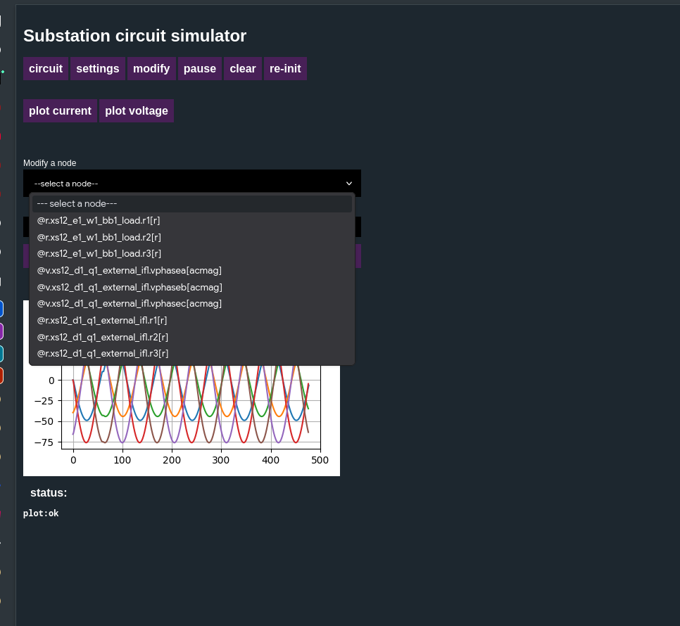

# Как сымитировать КЗ (Короткое замыкание) в iec61850_open_server (Honeypot Simulation)

В основе этого симулятора лежит физический движок, который просчитывает электрические цепи. Чтобы сымитировать КЗ, нам нужно резко уменьшить сопротивление нагрузки (сделать его близким к нулю).

Как показано на скриншоте, в выпадающем меню Modify a node есть нужные нам переменные:

* Переменные, начинающиеся на @r...load... — это сопротивление (resistance) нагрузки на соответствующей фазе.
* Например: @r.xs12_e1_w1_bb1_load.r1[r] — это сопротивление нагрузки на фазе A (или фазе 1).

Шаги для симуляции КЗ:

* В выпадающем меню выберите @r.xs12_e1_w1_bb1_load.r1[r] (это фаза A).
* Появится поле для ввода значения. Введите туда очень маленькое число, например, 0.01 или 0.1 (имитация пробоя изоляции / короткого на землю).
* Нажмите кнопку modify.
* Сразу после этого нажмите plot current (показать ток).

Что должно произойти:

* На графике тока вы увидите резкий всплеск (амплитуда синусоиды одной из фаз взлетит вверх).
* Узел релейной защиты (IED2_PTOC) обнаружит этот скачок, выждет заданную уставку времени и отправит GOOSE-сообщение на отключение.
* Узел контроллера выключателя (IED1_XCBR) примет GOOSE и «разомкнет» цепь.
* В результате ток на графике должен упасть до нуля.

Вернуть систему в исходное состояние потом можно кнопкой re-init.
