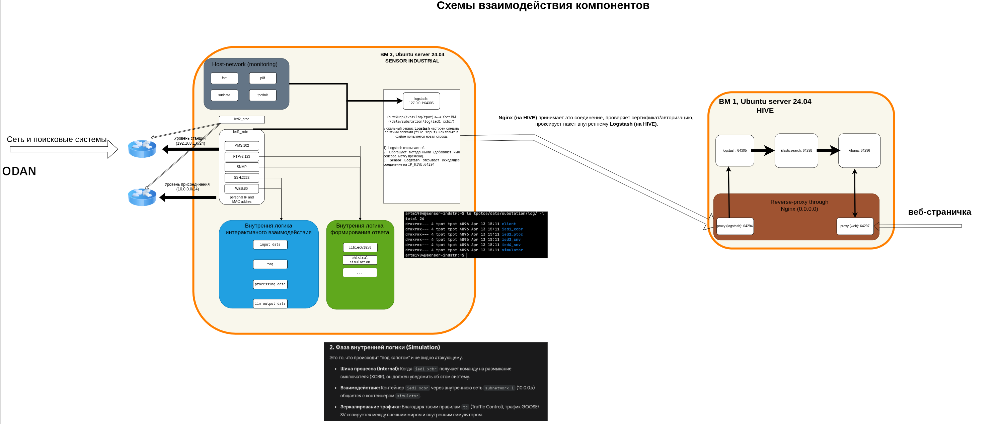
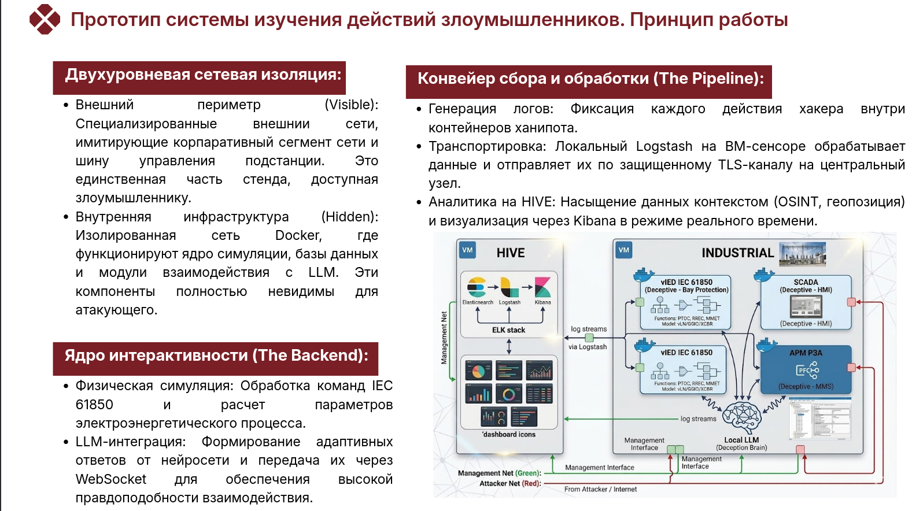

тут описано для чего нужен каждый компонент, с чем он взаимодействует, какие и как данные передает 

«Коллеги, давайте разберем механику работы нашего прототипа. Основная идея
заключается в создании иллюзии, которую невозможно отличить от реальности.
Для этого мы используем два слоя. Первый — это внешняя сеть. Хакер, проводя
сканирование, видит только её. Благодаря драйверу macvlan устройства имеют уникальные
MAC- и IP-адреса, что делает их абсолютно естественными для инструментов вроде nmap
или Shodan.
Второй слой — это то, что происходит "под капотом", во внутренней сети Docker. Здесь
кипит основная работа, скрытая от глаз злоумышленника. Когда хакер вводит команду на
размыкание выключателя через MMS-протокол, запрос уходит во внутренний симулятор.
Там рассчитывается физика процесса, обновляются состояния в базе данных, и через
WebSocket-трафик информация передается обратно. Параллельно с этим, если
злоумышленник общается с терминалом через SSH, запрос улетает к нашей локальной
LLM, которая генерирует контекстный ответ.
Но обнаружение — это только полдела. Нам важно собрать доказательную базу. Ханипот
записывает каждое движение нарушителя. Локальный сервис Logstash на сенсоре
подхватывает эти записи, парсит их и по зашифрованному TLS-туннелю пересылает на
нашу центральную станцию — ВМ HIVE.
Там данные попадают в руки мощного аналитического стека ELK. Мы не просто смотрим
логи — система автоматически сопоставляет IP-адрес атакующего с базами
данных Spiderfoot, определяет его местоположение и тип используемых инструментов. В
итоге на дашбордах Kibana мы видим не просто сухой текст, а живую, детализированную
картину атаки, что позволяет нам изучать тактики и техники злоумышленников (TTPs) без
малейшего риска для реальной энергосистемы»

